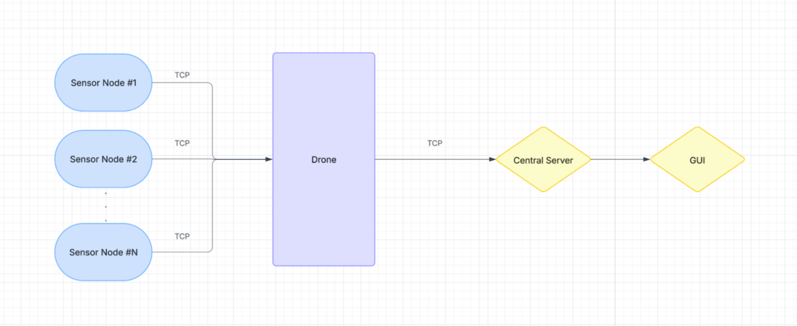

# Drone-Enabled Mobile Edge Monitoring — CS 408 Term-Project  
*Tuğberk Abdulkadiroğlu 26492 • Emre Gökay Kılınç 28086 • Melike Ceyda Gür 31050*

<div align="center">
  
</div>

## 1  Overview
This prototype simulates a **low-cost environmental-monitoring platform** that uses  
mobile-edge drones to preprocess sensor streams before sending concise summaries to a
central control room.

Component&nbsp;&nbsp;| Role | Tech
:---|:---|:---
`sensor/` | Headless processes that emit **temperature / humidity** JSON every *N* s | `asyncio`
`drone/`  | Edge node – **TCP server** for sensors & **TCP client** for Central; performs rolling averages, anomaly detection and battery simulation | `asyncio + Tkinter + Matplotlib`
`central/` | Final aggregation & visualization GUI; optional control commands | `asyncio + Tkinter`

---

## 2  Features
* **≥3 simultaneous sensor links** with auto-reconnect
* Rolling means (last 10 readings) + out-of-range anomaly flags  
  `temperature∉[0,60] °C`, `humidity∉[0,100] %`
* **Battery depletion demo** – GUI button drains 5 %; below 20 % the drone enters  
  *return-to-base* (forwards battery-only heart-beats)
* **Live GUIs**
  * **Drone GUI**: raw table, averages, progress-bar, anomaly list, two real-time
    Matplotlib charts (**temperature & humidity**)
  * **Central GUI**: rolling summary table, per-drone battery bars, global anomaly list, live log
* Fully asynchronous - no threads except GUI main-loop isolation
* Extensive logs for every connection, disconnection, anomaly and battery event

---

## 3  Requirements
* **Python ≥ 3.9** (standard library only: `asyncio`, `tkinter`, `logging`, `datetime`)
* `matplotlib  >= 3.6` (for live charts)

```bash
python -m pip install matplotlib
